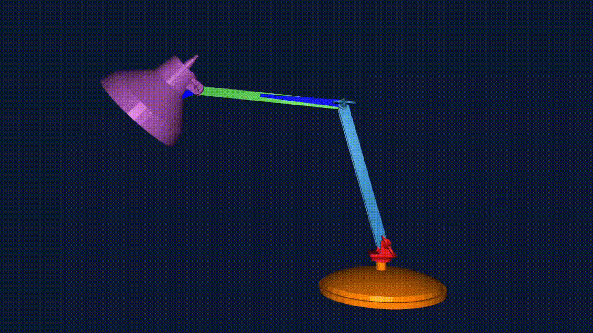

# Lamp Writer

<p align="center">
  
</p>

Showcase submission for University of Toronto CSC317 Computer Graphics Fall 2025.

Selected as [**Highlight Submissions**](https://www.dgp.toronto.edu/~joonho/courses/csc317-2025-09/showcase/).

## Instructions

Compile:
```bash
mkdir build
cd build
cmake .. -DCMAKE_BUILD_TYPE=Release
make -j$(nproc)
```

Create custom drawing (Optional):
```bash
python3 draw_animation.py
```

Run:
```bash
./build/kinematics ./data/ikea-lamp-drawn-csc317.json
```
## Description

This piece was inspired by the Pixar lamp intro from Pixar movies. I built an animated lamp that can create any given single stroke writing or drawing.

To the displayed effect, I made the following changes to A7. All modifications are made in [main.cpp](main.cpp), unless otherwise noted.
* Created a Python script [draw_animation.py](draw_animation.py), allowing users to interactively draw a desired trajectory.
* Implemented trajectory following in inverse kinematics mode, enabling the lamp to follow a set timestamped points.
* Added trailing effect to to progressively show the writing/drawing the lamp has made.

## Acknowledgements

This piece has used Python with NumPy and Matplotlib to create trajectories used for animation.

## Compilation Verification

Please check [piece/compilation_verification.mp4](piece/compilation_verification.mp4).
